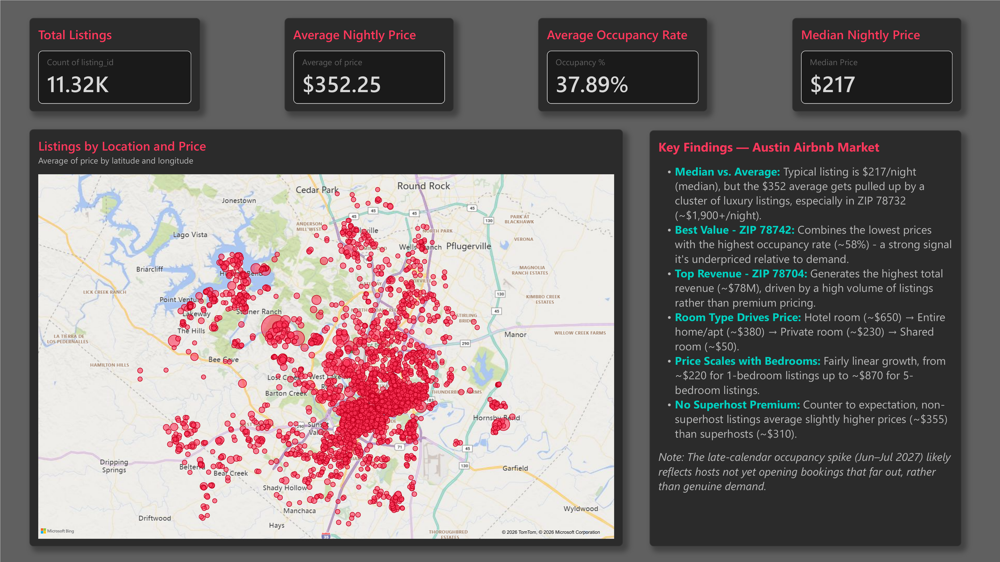
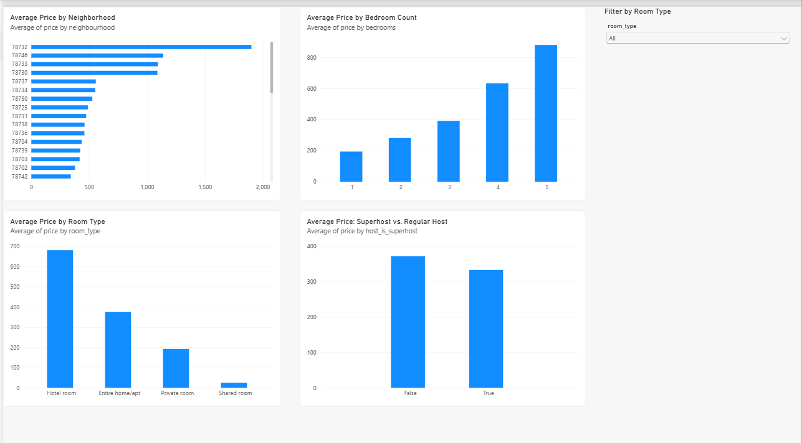
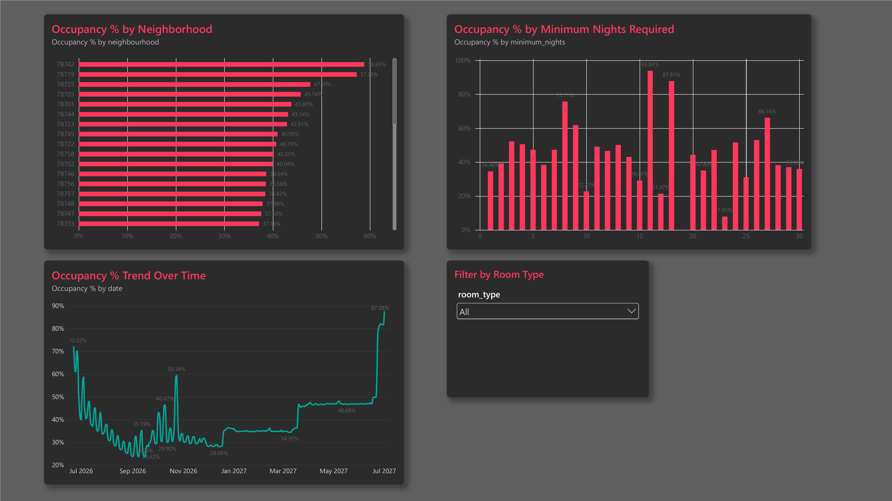
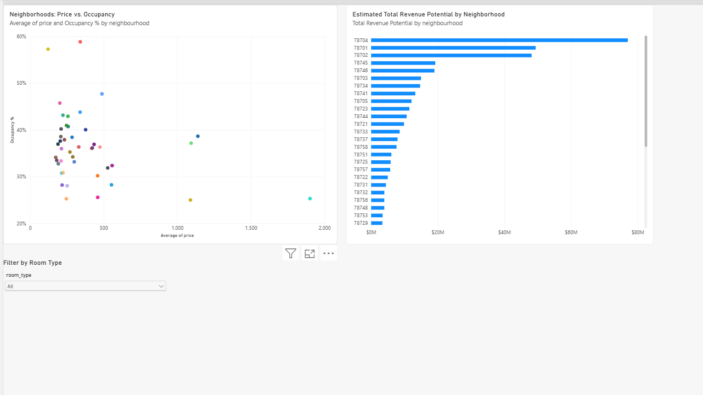

# Austin Airbnb Market Analysis

## Business Question
What drives pricing and occupancy on Airbnb in Austin, TX, and 
which neighborhoods book out fastest?

## Data Source
[Inside Airbnb](http://insideairbnb.com/get-the-data.html) - Austin, TX, 
detailed listings and calendar data (accessed 2026).

## Tools
- PostgreSQL / pgAdmin - data cleaning and SQL analysis
- Power BI - dashboard and visualization

## Process
1. Imported raw listings and calendar CSVs into staging tables (all text)
2. Cleaned and properly typed the data (prices, dates, booleans) into 
   `listings_clean` and `calendar_clean` tables
3. Ran SQL analysis on pricing drivers, occupancy patterns, and combined 
   price/occupancy performance by neighborhood
4. Built a 4-page Power BI dashboard connected live to PostgreSQL

## Key Findings
- Typical listing: $217/night (median), though the average ($352) is 
  pulled up by a smaller number of high-priced listings, particularly 
  in ZIP 78732 (~$1,900+/night average).
- ZIP 78742 combines a low average price (~$150) with the highest 
  occupancy rate (~58%) - a likely underpriced, high-opportunity area.
- ZIP 78704 generates the highest estimated total revenue (~$78M), 
  driven by listing volume rather than premium individual pricing.
- Room type strongly affects price: Hotel room listings average the 
  highest (~$650), followed by Entire home/apt (~$380), Private room 
  (~$230), and Shared room lowest (~$50).
- Price scales fairly linearly with bedroom count, from ~$220 for 
  1-bedroom listings up to ~$870 for 5-bedroom listings.
- Counter to expectation, non-superhost listings average slightly 
  higher prices (~$355) than superhost listings (~$310).
- Note: the sharp occupancy spike near the end of the calendar window 
  (Jun-Jul 2027) likely reflects hosts not yet opening bookings that 
  far out, rather than genuine demand.

## Dashboard Preview

## Repository Structure
- `sql/` - SQL scripts (staging tables, data cleaning, analysis queries)
- `data/` - sample of cleaned listings data (500 rows)
- `dashboard/` - Power BI (.pbix) file
- `screenshots/` - dashboard page exports